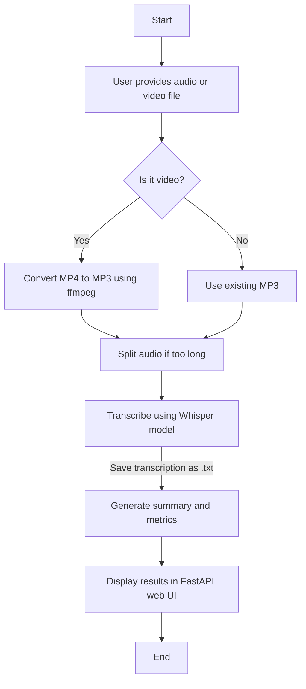

# 🎧 Whisper Transcription App

[](LICENSE)
[](https://github.com/openai/whisper)

---

A Python application for automatic transcription of audio and video files using OpenAI's Whisper model, 🔊 MP3/MP4 → ✍️ Text with optional summarization & metrics!

---

## 📚 Table of Contents

- [Diagram.](#diagram)
- [Features.](#-features)
- [Repository.](#-repository)
- [Whisper Model.](#-whisper-model)
- [Usage Guide.](#-usage-guide)

---

## Diagram



---

## 🚀 Features

- Batch transcription of MP3 and MP4 files.
- Automatic conversion of video files to MP3.
- Audio splitting for long files.
- Storage of transcriptions in text format.
- Summary and metrics generation.
- Simple web interface (FastAPI).
- Logs and result tracking.

---

## ✨ Features

- 🎵 Batch transcription of `.mp3` and `.mp4` files
- 🎥 Automatic conversion of videos to audio
- ✂️ Audio splitting for long files
- 📝 Transcription output in plain `.txt`
- 📊 Summary & analytics of transcripts
- 🌐 Simple FastAPI web interface
- 🧾 Logging and error tracking.

---

## 🔗 Repository

- **GitHub**: [https://github.com/omaciasd/whisper-transcription-app](https://github.com/omaciasd/whisper-transcription-app)
- **Demo** (FastAPI app): `http://localhost:8000` (after starting the app)

---

## 🧠 Whisper Model

By default, the app uses the `medium` Whisper model. You can change it by setting the `WHISPER_MODEL` environment variable:

```bash
$env:WHISPER_MODEL = "base"  # Windows PowerShell
export WHISPER_MODEL=large   # Linux/macOS
```

---

## 📘 Usage Guide

For detailed instructions on installation, setup, and usage, check out the [USAGE.md](./docs/USAGE.md) file.

---

> 🛠️ Built with ❤️ using [OpenAI Whisper](https://github.com/openai/whisper)

---
